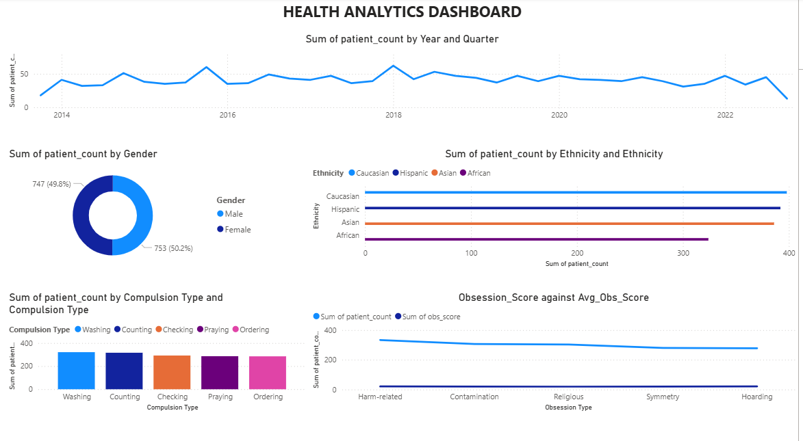

# OCD Patient Health Analytics

# Project Overview
This project focuses on the analysis of OCD (Obsessive-Compulsive Disorder) patient data to uncover critical insights using SQL and visualize them through an interactive Power BI dashboard. The dataset includes various attributes such as gender, ethnicity, obsession and compulsion types, Y-BOCS scores, and more.

Through this analysis, we aim to support healthcare professionals and researchers in understanding trends and severity patterns in OCD, assisting in informed decision-making.

# Dataset
Filename: ocd_patient_dataset.csv
Key Columns:
-Patient ID  
-Gender
-Ethnicity
-Obsession Type
-Compulsion Type
-Y-BOCS Score (Obsessions)
-Y-BOCS Score (Compulsions)
-OCD Diagnosis Date
-Education Level
-Depression Diagnosis, Anxiety Diagnosis

# Tools & Technologies Used
-SQL (MySQL syntax)
-Power BI (Dashboard design and visualization)
-GitHub (Repository and documentation)

# Business Questions
-What is the gender distribution of OCD patients?
-Which ethnicity reports the highest OCD prevalence?
-What are the most common obsession and compulsion types?
-How does the average Y-BOCS score vary with education level?
-How many patients have both anxiety and depression diagnoses?
-What is the severity distribution (Mild, Moderate, Severe) based on Y-BOCS?
-Are there any patterns in symptom duration or family history?

##Dashboard

# Dashboard Insights
   -The gender distribution is nearly equal, with females (50.2%) slightly more represented.
   -Caucasian and Asian ethnicities have the highest reported OCD cases.
   -Washing and Checking are the most common compulsion types.
   -Most common obsession types include Harm-related and Contamination.
   -Average obsession scores are highest for Hoarding and Symmetry.
   -A consistent trend of diagnosis is observed from 2013 to 2023.

This analysis provides actionable insights for improving diagnosis tracking, optimizing mental health interventions, and enhancing awareness of OCD symptoms and severity across different demographics.
